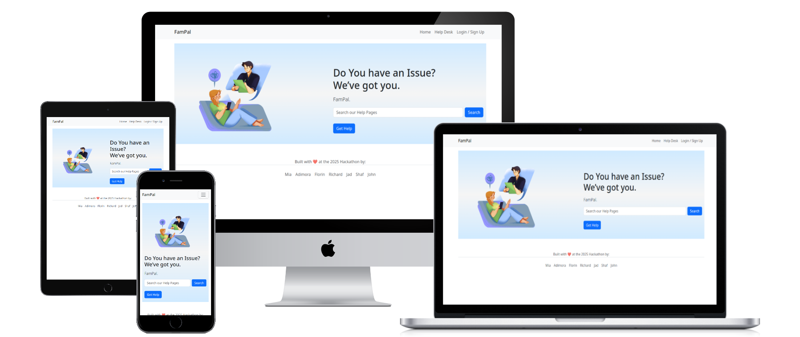
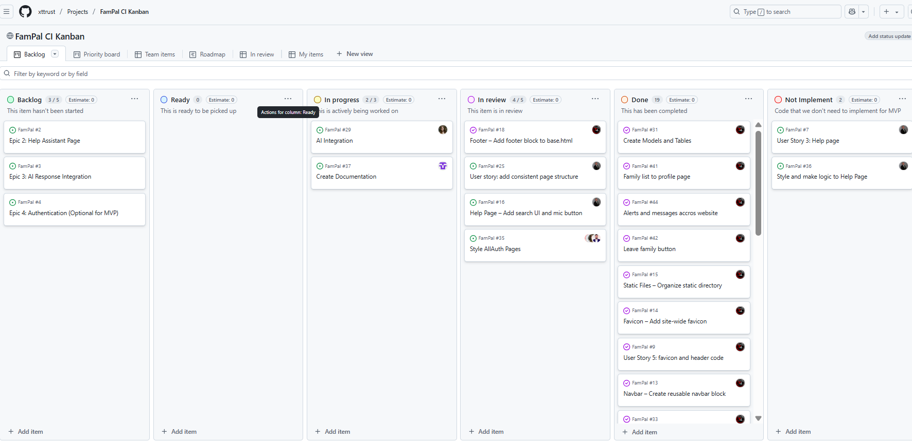

# FamPal

FamPal   is AI-Powered  Tech Support App  designed to help family members  especially elders, kids, or less tech-savvy individuals It navigate and solve everyday technology issues. It works like a mini "IT support" system for your home.It is easy to learn and use.
The live link can be found here: [Live Site -  DamPal) (https://fampal-d6a25660fc9b.herokuapp.com/)



## Table of Contents
- [FamPal](#FamPal)
  - [Table of Contents](#table-of-contents)
- [User-Experience-Design](#user-experience-design)
  - [The-Strategy-Plane](#the-strategy-plane)
    - [Site-Goals](#site-goals)
    - [Agile Planning](#agile-planning)
      - [Epics](#epics)
      - [User Stories](#user-stories)
  - [The-Scope-Plane](#the-scope-plane)
  - [The-Structure-Plane](#the-structure-plane)
    - [Features](#features)
    - [Features Left To Implement](#features-left-to-implement)
  - [The-Skeleton-Plane](#the-skeleton-plane)
    - [Wireframes](#wireframes)
    - [Database-Design](#database-design)
    - [Security](#security)
  - [The-Surface-Plane](#the-surface-plane)
    - [Design](#design)
    - [Colour-Scheme](#colour-scheme)
    - [Typography](#typography)
    - [Imagery](#imagery)
  - [Technolgies](#technolgies)
  - [Testing](#testing)
  - [Deployment](#deployment)
    - [Version Control](#version-control)
    - [Heroku Deployment](#heroku-deployment)
    - [Run Locally](#run-locally)
    - [Fork Project](#fork-project)
  - [Credits](#credits)

# User-Experience-Design

## The-Strategy-Plane

### Site-Goals

The aim of a FamPal is to make technology easier, safer, and more accessible for all family members, especially those who may struggle with it, like elders, kids, or non-tech-savvy users. It Makes technology less intimidating for older adults and easier for children to learn responsibly and as well Free up tech-savvy family members from constantly answering repetitive questions.


### Agile Planning

This project was developed using agile methodologies by delivering small features in incremental sprints. There were 3 sprints in total, spaced out evenly over four weeks.

All projects were  prioritized under the labels, Must have, should have, could have.  "Must have" stories were completed first, "should haves" and then finally "could haves". It was done this way to ensure that all core requirements were completed first to give the project a complete feel, with the nice to have features being added should there be capacity.

The  board was created using github projects and can be located [here](https://github.com/users/xttrust/projects/13) and can be viewed to see more information on the project cards. 




#### The project

The project were completed in parts: 

**Part 1 - Base Setup**

The base setup  is for all stories needed for the base set up of the application. The most of template  used depend in the base.template


**Part 2 - Authentication**

The authentication  is for all stories related to the registration, login and authorization of views. This part provides critical functionality 

**part 3 - AI funtionality**

The AI is ..........

**Part 4 - Data base**

Th database was design.....

**Part 5 - Deployment**

This  is  all about  stories related to deploying the app to heroku so that the site is live for user and customer use.

**Part  6 - Documentation**

This part is for all document-related stories and tasks that are needed to document the software development lifecycle of the application. It aims to deliver quality documentation, explaining all stages of development and necessary information on running, deploying and  how the app works .

#### User Stories

The following are the project  plan
**Part1  - Base Setup**

As a developer, I need to create the base.html page and structureso that other pages can reuse the layout


As a developer, I need to create the footer with social media links and contact information

As a developer, I need to create the navbar so that users can navigate the website from any device

**EPIC 2 - Stand alone Pages**

As a developer, I need to implement a 404 error page to alert users when they have accessed a page that doesn't exist

As a developer, I need to implement a 500 error page to alert users when an internal server error occurs

As a developer, I need to implement a 403 error page to redirect unauthorised users to so that I can secure my views


**Part 3 - Authentication**

As a developer, I need to implement allauth so that users can sign up and have access to the websites features

as a user i want..........


**Part 4 - AI**

As a user user, I want AI to be able to resove all my tech  issues

As a user user, I want AI ........


**Part 7 - Documentation**

Tasks:

* Complete readme documentation
* Complete testing documentation write up

## The-Scope-Plane

* Responsive Design - Site should be fully functional on all devices from 320px up
* Hamburger menu for mobile devices
* Ability to log on and out the User
* Ability For AI to resove the tech issues

## The-Structure-Plane

### Features

``USER STORY - As a developer, I need to create the navbar so that users can navigate the website from any device``

Implementation:

**Navigation Menu**

 The Navigation contains links for , Logo, Home, Help desk,Sign in/ login and footer

The following navigation items are available on all pages:
  * Home -> index.html - Visible to all
  *  Helpdesk - visible to all users
  * Login/ signup -> Visible to all Users
  * Footer ->  visible to all
  
The navigation menu is displayed on all pages and drops down into a hamburger menu on smaller devices. This will allow users to view the site from any device and not take up too much space on mobile devices.


**Home Page**

1.  The home page contains  Navigation bar,  hero iamge, and footer


*  Nav bar makes this app easy to explore, so users don’t feel lost, Keep navigation consistent across all pages for familiarity and ease and Let users go straight to what they need without having to scroll or search.


*  hero image grabs attention instantly and visually communicates the core message or feeling of your website. It helps create a strong first impression, guiding users to engage further with your content.


*  Footer provides Team  information


**Help desk page**

Here AI.....


**403 Page**

A 403 error page has been implemented to provide feedback to the user when they try to access unauthorized content. Users will be directed to this page if they alter the URL's and attempt to edit, delete or access pages that are restricted. 

This covers:

``USER STORY - As a developer, I need to implement a 500 error page to alert users when an internal server error occurs``

Implementation:

**500 Page**

A 500 error page has been displayed to alert users when an internal server error occurs. The message relays to users that the problem is on our end, not theirs.

**Base Setup User Stories**

The following stories were implemented in order to set up a base structure for all the HTML pages and the core installations and configurations needed to run the application. While these do not show as individual features, they were stories completed that were needed to implement all of the stories above.

``As a developer, I need to create the base.html page and structure so that other pages can reuse the layout``

``As a developer, I need to create static resources so that images, css and javascript work on the website``

``As a developer, I need to set up the project so that it is ready for implementing the core features``


### Features Left To Implement
 The features that was left to implemt are.....


## The-Skeleton-Plane

### Wireframes

- Home page


- Signup page


- Log in


- Log Out


- Create Booking


### Database-Design

The database was designed to allow ......


### Security

Environment variables were stored in an env.py for local development for security purposes to ensure no secret keys, api keys or sensitive information was added the the repository. In production, these variables were added to the heroku config vars within the project. and DeBug was set to Falase before deplyoment , reason bein 1 , it was a good pratice and seconly to avoid breakage of the site during coustomer visiatoonand lastly , if not may expose vital secuity informatiom

## The-Surface-Plane
### Design

### Colour-Scheme

The main color schemes for the website is soft blue 

* 


## Technolgies

- HTML
  - The structure of the Website was developed using HTML as the main language.
- CSS
  - The Website was styled using custom CSS in an external file.
- JavaScript
  - JavaScript was used to make the custom slider on the menu page change and the bootstrap date picker.
- Python
  - Python was the main programming language used for the application using the Django Framework.
- Visual Studio Code
  - The website was developed using Visual Studio Code IDE
- GitHub
  - Source code is hosted on GitHub
- Git
  - Used to commit and push code during the development of the Website
- Font Awesome
  
-  Herokoapp: For the deployment
  


## Testing


## Deployment

### Version Control

The site was created using the Visual Studio Code editor and pushed to github to the remote repository ‘FamPal’.

The following git commands were used throughout development to push code to the remote repo:

```git add <file>``` - This command was used to add the file(s) to the staging area before they are committed.

```git commit -m “commit message”``` - This command was used to commit changes to the local repository queue ready for the final step.

```git push``` - This command was used to push all committed code to the remote repository on github.

### Heroku Deployment

The site was deployed to Heroku. T

The live link can be found here: [Live Site](https://fampal-d6a25660fc9b.herokuapp.com/)

### Run Locally

Navigate to the GitHub Repository you want to clone to use locally:

- Click on the code drop down button
- Click on HTTPS
- Copy the repository link to the clipboard
- Open your IDE of choice (git must be installed for the next steps)
- Type git clone copied-git-url into the IDE terminal

The project will now have been cloned on your local machine for use.

### Fork Project

Most commonly, forks are used to either propose changes to someone else's project or to use someone else's project as a starting point for your own idea.

- Navigate to the GitHub Repository you want to fork.

- On the top right of the page under the header, click the fork button.

- This will create a duplicate of the full project in your GitHub Repository.

## Credits 
* Credit to .....
### Bugs  
-  There  are some  bugs that needed to be noted:
